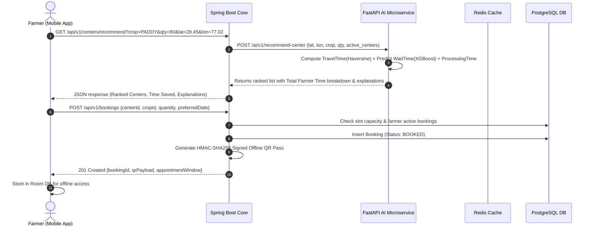
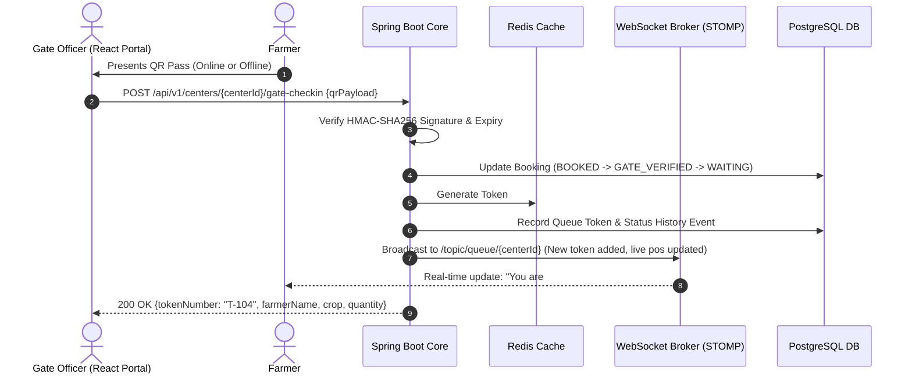
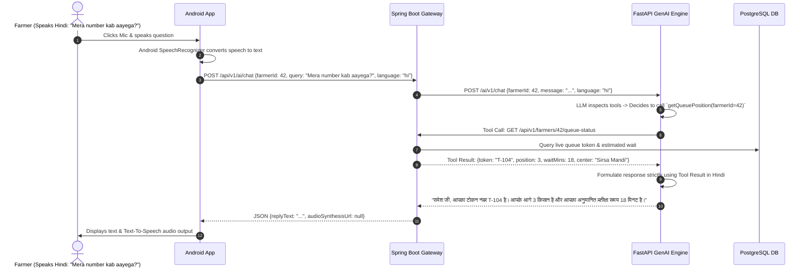

# Phase 2: Complete System Architecture & Sequence Flows

---

## 1. High-Level Architecture Overview

KisanSetu-AI is designed as an event-driven, micro-modular hybrid architecture combining a high-concurrency transactional Java Spring Boot core with a specialized Python FastAPI AI/ML microservice, decoupled via REST and Redis Pub/Sub, serving both offline-first Android mobile clients and React-based operations dashboards.

```
+---------------------------------------------------------------------------------------------------------+
|                                              CLIENT LAYER                                               |
|                                                                                                         |
|   +---------------------------------------+           +---------------------------------------------+   |
|   |   Android Mobile App (Farmer)         |           |   React 18 SPA (Officer / Admin)            |   |
|   |   - Jetpack Compose UI (Material 3)   |           |   - Vite + TypeScript + TailwindCSS         |   |
|   |   - Room DB (Offline QR & Cache)      |           |   - Recharts (Throughput & Bottlenecks)     |   |
|   |   - Retrofit + OkHttp Client          |           |   - Leaflet / MapLibre (Spatial Heatmaps)   |   |
|   |   - Android SpeechRecognizer (Voice)  |           |   - WebSocket STOMP Client (Live Queue)     |   |
|   +-------------------+-------------------+           +----------------------+----------------------+   |
+-----------------------|------------------------------------------------------|--------------------------+
                        | HTTPS / WSS (TLS 1.3)                                | HTTPS / WSS (TLS 1.3)
                        v                                                      v
+---------------------------------------------------------------------------------------------------------+
|                                    API GATEWAY & SECURITY PERIMETER                                     |
|                                                                                                         |
|   - Nginx Reverse Proxy / SSL Termination                                                               |
|   - Rate Limiting (Bucket4j: 100 req/min per IP / JWT)                                                  |
|   - CORS Configuration & CSP Headers                                                                   |
+---------------------------------------------------|-----------------------------------------------------+
                                                    |
                                                    v
+---------------------------------------------------------------------------------------------------------+
|                                  SPRING BOOT 3.x CORE BACKEND (JAVA 21)                                 |
|                                                                                                         |
|   +--------------------+  +--------------------+  +--------------------+  +-------------------------+   |
|   | Security & Auth    |  | Booking Engine     |  | State Machine      |  | Real-Time Notification  |   |
|   | - Spring Security6 |  | - Dynamic Slots    |  | - 11 Stage Engine  |  | - STOMP WebSocket Hub   |   |
|   | - Stateless JWT    |  | - Auto-Reschedule  |  | - Audit Trail Log  |  | - SMS/Push Dispatcher   |   |
|   +--------------------+  +--------------------+  +--------------------+  +-------------------------+   |
|   +--------------------+  +--------------------+  +--------------------+  +-------------------------+   |
|   | Queue Engine       |  | Center Registry    |  | Grievance System   |  | Tool-Gateway for AI     |   |
|   | - Virtual Token Id |  | - Counter Mgmt     |  | - SLA Escalation   |  | - Zero-Hallucination    |   |
|   | - FIFO + Priority  |  | - Capacity Watcher |  | - Farmer Feedback  |  |   API Provider           |   |
|   +--------------------+  +--------------------+  +--------------------+  +-------------------------+   |
+--------------------------|---------------------------------|-----------------------------|--------------+
                           |                                 |                             |
                           v                                 v                             v
+------------------------------------+  +------------------------------------+  +-------------------------+
|        POSTGRESQL 16 RDBMS         |  |         REDIS IN-MEMORY DB         |  |   FASTAPI AI SERVICE    |
|                                    |  |                                    |  |       (PYTHON 3)        |
| - Relational integrity (16 tables) |  | - Live token queue cache (SortedSet│  | - XGBoost Wait Model    |
| - Composite & Spatial B-Tree index |  | - Distributed locks (Redisson)     |  | - Congestion Predictor  |
| - Audit logs with JSONB payloads   |  | - Pub/Sub event bus for live queue |  | - Center Recommender    |
| - DBT & Payment transaction store  |  | - Farmer session & auth cache      |  | - Multilingual LLM Agent|
+------------------------------------+  +------------------------------------+  +-------------------------+
```

---

## 2. Core End-to-End Sequence Flows

### Sequence 1: Dynamic Center Recommendation & Slot Booking


### Sequence 2: Gate Arrival, QR Scan & Token Dispatch


### Sequence 3: Complete 11-Stage State Progression

```mermaid
stateDiagram-v2
    [*] --> BOOKED: Farmer books slot
    BOOKED --> ARRIVED: GPS Geofence Check-in (Optional)
    ARRIVED --> GATE_VERIFIED: Officer scans QR at gate
    BOOKED --> GATE_VERIFIED: Direct Gate QR Scan
    GATE_VERIFIED --> WAITING: Token issued in FIFO queue
    WAITING --> WEIGHING: Called to Weighbridge 1 / 2
    WEIGHING --> QUALITY_CHECK: Gross weight logged; Sample sent to Lab
    QUALITY_CHECK --> ACCEPTED: Moisture <= 17%, Impurities <= 2%
    QUALITY_CHECK --> REJECTED: Failed quality standards (Grievance option)
    ACCEPTED --> UNLOADING: Tare weighbridge deduction logged
    UNLOADING --> DOCUMENTATION: J-Form / MSP Procurement Receipt generated
    DOCUMENTATION --> PAYMENT_PROCESSING: DBT payload dispatched to PFMS
    PAYMENT_PROCESSING --> PAYMENT_COMPLETED: Bank webhook / UTR confirmed
    
    BOOKED --> CANCELLED: Farmer cancels > 12h prior
    BOOKED --> RESCHEDULED: Missed slot auto-rescheduled or manual
    WAITING --> RESCHEDULED: Mandi emergency breakdown
    PAYMENT_PROCESSING --> [*]
    PAYMENT_COMPLETED --> [*]
    REJECTED --> [*]
    CANCELLED --> [*]
```


### Sequence 4: Multilingual Voice Assistant Tool-Calling Flow (Zero Hallucination)


---

## 3. Security, Privacy & Integrity Specifications

1. **Stateless JWT with Role-Based Access Control (RBAC)**:
   * Roles: `ROLE_FARMER`, `ROLE_OFFICER`, `ROLE_ADMIN`, `ROLE_SYSTEM_AI`.
   * Signed using RSA-256 / HMAC-SHA512 with 24-hour expiration and refresh token rotation.
2. **Cryptographic Offline QR Pass**:
   * Payload: `{"bId": 1092, "fId": 402, "cId": 12, "crop": "WHEAT", "qty": 65, "exp": 1780000000, "sig": "hmac256_hash"}`
   * Allows Gate Officers to verify authentic bookings even if the entire mandi internet connectivity is completely offline.
3. **Database Concurrency & Race-Condition Prevention**:
   * Pessimistic locking (`PESSIMISTIC_WRITE`) and Redis Redisson distributed locks for slot booking and token generation to prevent double-booking or duplicate token numbering under peak concurrent loads.
4. **Auditability & Traceability**:
   * Every stage change is logged in `status_history` and `queue_events` with actor ID, timestamp, GPS coordinate (if available), and previous vs new state.

---

## 4. Scalability & High Availability Matrix

* **Throughput Target**: 2,500 requests/second at peak morning check-in hours across 500 mandis.
* **Latency SLAs**:
  * QR Code Scan & Verification: $< 150 \text{ ms}$
  * Live Queue Position Query: $< 25 \text{ ms}$ (Redis in-memory lookup)
  * ML Wait Time Inference: $< 40 \text{ ms}$ (Pre-warmed XGBoost model in FastAPI)
  * WebSocket Live Queue Broadcast: $< 80 \text{ ms}$ fanout latency
