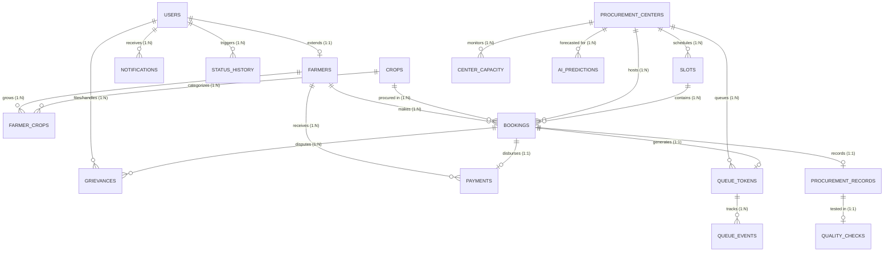

# Phase 3: Database Schema, Relational Integrity, Performance Indexing & ER Model

---

## 1. Relational Entity-Relationship (ER) Overview

The KisanSetu-AI database model consists of 17 core relational tables engineered for high-concurrency transactional consistency, strict audit logging, geospatial queries, and real-time queue synchronization.



---

## 2. Table Specifications & Constraints

### 1. `users`
Authentication, roles, language preferences, and contact information.
* `id` BIGSERIAL PRIMARY KEY
* `mobile_number` VARCHAR(15) NOT NULL UNIQUE
* `password_hash` VARCHAR(255) NOT NULL
* `full_name` VARCHAR(100) NOT NULL
* `role` VARCHAR(20) NOT NULL CHECK (role IN ('ROLE_FARMER', 'ROLE_OFFICER', 'ROLE_ADMIN', 'ROLE_SYSTEM'))
* `preferred_language` VARCHAR(10) DEFAULT 'hi'
* `is_active` BOOLEAN DEFAULT TRUE
* `created_at` TIMESTAMPTZ DEFAULT CURRENT_TIMESTAMP
* `updated_at` TIMESTAMPTZ DEFAULT CURRENT_TIMESTAMP

### 2. `farmers`
Extended profile for farmers with landholding, DBT bank details, and geographic location.
* `id` BIGSERIAL PRIMARY KEY
* `user_id` BIGINT NOT NULL UNIQUE REFERENCES users(id) ON DELETE CASCADE
* `aadhaar_hash` VARCHAR(64) NOT NULL UNIQUE
* `state` VARCHAR(50) NOT NULL
* `district` VARCHAR(50) NOT NULL
* `sub_district` VARCHAR(50)
* `village` VARCHAR(100) NOT NULL
* `pincode` VARCHAR(10) NOT NULL
* `latitude` DOUBLE PRECISION NOT NULL
* `longitude` DOUBLE PRECISION NOT NULL
* `landholding_acres` NUMERIC(6, 2) NOT NULL CHECK (landholding_acres > 0)
* `bank_account_number` VARCHAR(30) NOT NULL
* `bank_ifsc` VARCHAR(15) NOT NULL
* `bank_name` VARCHAR(100) NOT NULL
* `created_at` TIMESTAMPTZ DEFAULT CURRENT_TIMESTAMP

### 3. `procurement_centers`
Mandi facilities, capacity limits, geographic coordinates, and live operational parameters.
* `id` BIGSERIAL PRIMARY KEY
* `center_code` VARCHAR(30) NOT NULL UNIQUE
* `center_name` VARCHAR(150) NOT NULL
* `agency_name` VARCHAR(50) NOT NULL -- 'NAFED', 'FCI', 'HAFED', 'CCI', 'MSWC'
* `state` VARCHAR(50) NOT NULL
* `district` VARCHAR(50) NOT NULL
* `address` TEXT NOT NULL
* `latitude` DOUBLE PRECISION NOT NULL
* `longitude` DOUBLE PRECISION NOT NULL
* `total_weighbridges` INT NOT NULL DEFAULT 2 CHECK (total_weighbridges >= 1)
* `active_weighbridges` INT NOT NULL DEFAULT 2 CHECK (active_weighbridges >= 0)
* `total_quality_labs` INT NOT NULL DEFAULT 1 CHECK (total_quality_labs >= 1)
* `daily_capacity_quintals` NUMERIC(10, 2) NOT NULL DEFAULT 3000.00
* `operating_start_time` TIME NOT NULL DEFAULT '08:00:00'
* `operating_end_time` TIME NOT NULL DEFAULT '18:00:00'
* `is_active` BOOLEAN DEFAULT TRUE
* `created_at` TIMESTAMPTZ DEFAULT CURRENT_TIMESTAMP

### 4. `crops`
Crops procured at MSP, standard processing benchmarks, and maximum allowable tolerance parameters.
* `id` BIGSERIAL PRIMARY KEY
* `crop_code` VARCHAR(20) NOT NULL UNIQUE -- 'PADDY_COMMON', 'WHEAT_FAQ', 'COTTON_MEDIUM', 'MUSTARD', 'SOYABEAN'
* `crop_name_en` VARCHAR(50) NOT NULL
* `crop_name_hi` VARCHAR(50) NOT NULL
* `season` VARCHAR(20) NOT NULL CHECK (season IN ('KHARIF', 'RABI', 'ZAID'))
* `msp_rate_per_quintal` NUMERIC(10, 2) NOT NULL
* `max_moisture_percentage` NUMERIC(4, 2) NOT NULL DEFAULT 17.00
* `max_foreign_matter_percentage` NUMERIC(4, 2) NOT NULL DEFAULT 2.00
* `standard_assay_duration_mins` INT NOT NULL DEFAULT 10
* `standard_weigh_duration_mins` INT NOT NULL DEFAULT 8
* `standard_unload_rate_quintals_per_min` NUMERIC(5, 2) NOT NULL DEFAULT 4.00

### 5. `farmer_crops`
Registered crops and verified acreage per farmer.
* `id` BIGSERIAL PRIMARY KEY
* `farmer_id` BIGINT NOT NULL REFERENCES farmers(id) ON DELETE CASCADE
* `crop_id` BIGINT NOT NULL REFERENCES crops(id) ON DELETE RESTRICT
* `cultivated_acres` NUMERIC(6, 2) NOT NULL CHECK (cultivated_acres > 0)
* `estimated_yield_quintals` NUMERIC(8, 2) NOT NULL CHECK (estimated_yield_quintals > 0)
* `verified_by_patwari` BOOLEAN DEFAULT TRUE
* `season_year` VARCHAR(10) NOT NULL -- '2025-26'
* UNIQUE(farmer_id, crop_id, season_year)

### 6. `slots`
Time windows for arrival coordination and capacity management.
* `id` BIGSERIAL PRIMARY KEY
* `center_id` BIGINT NOT NULL REFERENCES procurement_centers(id) ON DELETE CASCADE
* `slot_date` DATE NOT NULL
* `start_time` TIME NOT NULL
* `end_time` TIME NOT NULL
* `max_vehicles` INT NOT NULL DEFAULT 20
* `booked_vehicles` INT NOT NULL DEFAULT 0
* `max_tonnage_quintals` NUMERIC(10, 2) NOT NULL DEFAULT 1000.00
* `booked_tonnage_quintals` NUMERIC(10, 2) NOT NULL DEFAULT 0.00
* `status` VARCHAR(20) NOT NULL DEFAULT 'OPEN' CHECK (status IN ('OPEN', 'FULL', 'CLOSED', 'EMERGENCY_HOLD'))
* UNIQUE(center_id, slot_date, start_time)

### 7. `bookings`
Central appointment booking ledger with state tracking and offline cryptographic security token.
* `id` BIGSERIAL PRIMARY KEY
* `booking_reference` VARCHAR(40) NOT NULL UNIQUE
* `farmer_id` BIGINT NOT NULL REFERENCES farmers(id) ON DELETE RESTRICT
* `center_id` BIGINT NOT NULL REFERENCES procurement_centers(id) ON DELETE RESTRICT
* `crop_id` BIGINT NOT NULL REFERENCES crops(id) ON DELETE RESTRICT
* `slot_id` BIGINT NOT NULL REFERENCES slots(id) ON DELETE RESTRICT
* `scheduled_date` DATE NOT NULL
* `estimated_quantity_quintals` NUMERIC(8, 2) NOT NULL CHECK (estimated_quantity_quintals > 0)
* `vehicle_type` VARCHAR(30) NOT NULL -- 'TRACTOR_TROLLEY', 'TEMPO', 'TRUCK_6WHEEL', 'BULLOCK_CART'
* `vehicle_number` VARCHAR(20) NOT NULL
* `status` VARCHAR(30) NOT NULL DEFAULT 'BOOKED' CHECK (status IN (
    'BOOKED', 'ARRIVED', 'GATE_VERIFIED', 'WAITING', 'WEIGHING', 
    'QUALITY_CHECK', 'ACCEPTED', 'UNLOADING', 'DOCUMENTATION', 
    'PAYMENT_PROCESSING', 'PAYMENT_COMPLETED', 'CANCELLED', 'RESCHEDULED', 'REJECTED'
  ))
* `offline_qr_signature` TEXT NOT NULL
* `offline_pass_expiry` TIMESTAMPTZ NOT NULL
* `cancellation_reason` TEXT
* `rescheduled_from_booking_id` BIGINT REFERENCES bookings(id)
* `created_at` TIMESTAMPTZ DEFAULT CURRENT_TIMESTAMP
* `updated_at` TIMESTAMPTZ DEFAULT CURRENT_TIMESTAMP

### 8. `queue_tokens`
Live virtual queue tokens issued at gate verification.
* `id` BIGSERIAL PRIMARY KEY
* `booking_id` BIGINT NOT NULL UNIQUE REFERENCES bookings(id) ON DELETE RESTRICT
* `center_id` BIGINT NOT NULL REFERENCES procurement_centers(id) ON DELETE RESTRICT
* `token_number` VARCHAR(20) NOT NULL -- e.g. 'T-104'
* `daily_sequence_num` INT NOT NULL
* `token_date` DATE NOT NULL
* `priority_score` INT NOT NULL DEFAULT 0 -- For elderly/emergency perishables
* `current_stage` VARCHAR(30) NOT NULL DEFAULT 'WAITING'
* `assigned_weighbridge` VARCHAR(20)
* `assigned_lab_counter` VARCHAR(20)
* `token_status` VARCHAR(20) NOT NULL DEFAULT 'ACTIVE' CHECK (token_status IN ('ACTIVE', 'SERVED', 'SKIPPED', 'CANCELLED'))
* `issued_at` TIMESTAMPTZ DEFAULT CURRENT_TIMESTAMP
* `called_at` TIMESTAMPTZ
* `completed_at` TIMESTAMPTZ
* UNIQUE(center_id, token_date, daily_sequence_num)

### 9. `procurement_records`
Physical procurement weights, receipts, and value calculations.
* `id` BIGSERIAL PRIMARY KEY
* `booking_id` BIGINT NOT NULL UNIQUE REFERENCES bookings(id) ON DELETE RESTRICT
* `gross_weight_kg` NUMERIC(10, 2) NOT NULL CHECK (gross_weight_kg > 0)
* `tare_weight_kg` NUMERIC(10, 2) NOT NULL CHECK (tare_weight_kg >= 0)
* `net_weight_kg` NUMERIC(10, 2) NOT NULL CHECK (net_weight_kg > 0)
* `net_weight_quintals` NUMERIC(10, 2) NOT NULL CHECK (net_weight_quintals > 0)
* `bags_count` INT NOT NULL CHECK (bags_count > 0)
* `applied_msp_rate` NUMERIC(10, 2) NOT NULL
* `total_procurement_amount` NUMERIC(12, 2) NOT NULL
* `j_form_receipt_number` VARCHAR(50) NOT NULL UNIQUE
* `weighbridge_operator_id` BIGINT REFERENCES users(id)
* `created_at` TIMESTAMPTZ DEFAULT CURRENT_TIMESTAMP

### 10. `quality_checks`
Scientific quality assay results against MSP Fair Average Quality (FAQ) standards.
* `id` BIGSERIAL PRIMARY KEY
* `procurement_record_id` BIGINT NOT NULL UNIQUE REFERENCES procurement_records(id) ON DELETE CASCADE
* `sample_barcode` VARCHAR(50) NOT NULL UNIQUE
* `moisture_percentage` NUMERIC(5, 2) NOT NULL CHECK (moisture_percentage >= 0)
* `foreign_matter_percentage` NUMERIC(5, 2) NOT NULL CHECK (foreign_matter_percentage >= 0)
* `broken_grains_percentage` NUMERIC(5, 2) NOT NULL DEFAULT 0.00
* `immature_shriveled_percentage` NUMERIC(5, 2) NOT NULL DEFAULT 0.00
* `quality_grade` VARCHAR(20) NOT NULL CHECK (quality_grade IN ('GRADE_A', 'GRADE_B', 'FAQ_STANDARD', 'REJECTED'))
* `is_approved` BOOLEAN NOT NULL
* `rejection_reason` TEXT
* `assayed_by_officer_id` BIGINT NOT NULL REFERENCES users(id)
* `assayed_at` TIMESTAMPTZ DEFAULT CURRENT_TIMESTAMP

### 11. `payments`
Direct Benefit Transfer (DBT) and PFMS disbursement tracking.
* `id` BIGSERIAL PRIMARY KEY
* `booking_id` BIGINT NOT NULL UNIQUE REFERENCES bookings(id) ON DELETE RESTRICT
* `farmer_id` BIGINT NOT NULL REFERENCES farmers(id) ON DELETE RESTRICT
* `gross_amount` NUMERIC(12, 2) NOT NULL
* `statutory_deductions` NUMERIC(10, 2) NOT NULL DEFAULT 0.00 -- Labor, Gunny bags if applicable
* `net_payable_amount` NUMERIC(12, 2) NOT NULL
* `payment_mode` VARCHAR(30) NOT NULL DEFAULT 'DBT_PFMS'
* `bank_account_number` VARCHAR(30) NOT NULL
* `bank_ifsc` VARCHAR(15) NOT NULL
* `pfms_transaction_id` VARCHAR(60)
* `bank_utr_number` VARCHAR(60)
* `payment_status` VARCHAR(30) NOT NULL DEFAULT 'INITIATED' CHECK (payment_status IN ('INITIATED', 'PROCESSING', 'COMPLETED', 'FAILED'))
* `failure_reason` TEXT
* `initiated_at` TIMESTAMPTZ DEFAULT CURRENT_TIMESTAMP
* `completed_at` TIMESTAMPTZ

### 12. `notifications`
Multi-channel farmer and officer communication log.
* `id` BIGSERIAL PRIMARY KEY
* `user_id` BIGINT NOT NULL REFERENCES users(id) ON DELETE CASCADE
* `booking_id` BIGINT REFERENCES bookings(id) ON DELETE SET NULL
* `title` VARCHAR(150) NOT NULL
* `message` TEXT NOT NULL
* `channel` VARCHAR(20) NOT NULL CHECK (channel IN ('PUSH', 'SMS', 'WHATSAPP', 'VOICE'))
* `language_code` VARCHAR(10) NOT NULL DEFAULT 'hi'
* `is_sent` BOOLEAN DEFAULT TRUE
* `is_read` BOOLEAN DEFAULT FALSE
* `created_at` TIMESTAMPTZ DEFAULT CURRENT_TIMESTAMP

### 13. `status_history`
Append-only audit trail for all operational state changes.
* `id` BIGSERIAL PRIMARY KEY
* `entity_type` VARCHAR(30) NOT NULL -- 'BOOKING', 'TOKEN', 'PAYMENT', 'QUALITY'
* `entity_id` BIGINT NOT NULL
* `from_status` VARCHAR(40)
* `to_status` VARCHAR(40) NOT NULL
* `changed_by_user_id` BIGINT REFERENCES users(id)
* `change_reason` TEXT
* `metadata_json` JSONB
* `recorded_at` TIMESTAMPTZ DEFAULT CURRENT_TIMESTAMP

### 14. `center_capacity`
Hourly operational metrics, active counters, and congestion indices for AI training.
* `id` BIGSERIAL PRIMARY KEY
* `center_id` BIGINT NOT NULL REFERENCES procurement_centers(id) ON DELETE CASCADE
* `recorded_date` DATE NOT NULL
* `hour_of_day` INT NOT NULL CHECK (hour_of_day BETWEEN 0 AND 23)
* `active_weighbridges` INT NOT NULL DEFAULT 2
* `active_quality_labs` INT NOT NULL DEFAULT 1
* `waiting_tractors_count` INT NOT NULL DEFAULT 0
* `processing_tractors_count` INT NOT NULL DEFAULT 0
* `served_tractors_last_hour` INT NOT NULL DEFAULT 0
* `avg_waiting_time_mins` NUMERIC(6, 2) NOT NULL DEFAULT 0.00
* `avg_processing_time_mins` NUMERIC(6, 2) NOT NULL DEFAULT 0.00
* `congestion_level` VARCHAR(20) NOT NULL DEFAULT 'LOW' CHECK (congestion_level IN ('LOW', 'MODERATE', 'HIGH', 'CRITICAL'))
* `weather_condition` VARCHAR(30) DEFAULT 'CLEAR'
* `created_at` TIMESTAMPTZ DEFAULT CURRENT_TIMESTAMP
* UNIQUE(center_id, recorded_date, hour_of_day)

### 15. `queue_events`
Fine-grained stage-by-stage timestamp logs for bottleneck detection algorithms.
* `id` BIGSERIAL PRIMARY KEY
* `center_id` BIGINT NOT NULL REFERENCES procurement_centers(id) ON DELETE CASCADE
* `queue_token_id` BIGINT NOT NULL REFERENCES queue_tokens(id) ON DELETE CASCADE
* `stage` VARCHAR(30) NOT NULL
* `entered_stage_at` TIMESTAMPTZ NOT NULL
* `exited_stage_at` TIMESTAMPTZ
* `duration_seconds` INT
* `is_bottleneck_flag` BOOLEAN DEFAULT FALSE
* `created_at` TIMESTAMPTZ DEFAULT CURRENT_TIMESTAMP

### 16. `grievances`
Farmer dispute resolution and SLA tracking.
* `id` BIGSERIAL PRIMARY KEY
* `farmer_id` BIGINT NOT NULL REFERENCES farmers(id) ON DELETE RESTRICT
* `booking_id` BIGINT REFERENCES bookings(id) ON DELETE SET NULL
* `center_id` BIGINT REFERENCES procurement_centers(id) ON DELETE SET NULL
* `category` VARCHAR(40) NOT NULL CHECK (category IN ('QUALITY_DISPUTE', 'WEIGHT_DISPUTE', 'DELAY_CONGESTION', 'PAYMENT_DELAY', 'OFFICER_BEHAVIOR', 'OTHER'))
* `description` TEXT NOT NULL
* `status` VARCHAR(20) NOT NULL DEFAULT 'OPEN' CHECK (status IN ('OPEN', 'UNDER_INVESTIGATION', 'RESOLVED', 'REJECTED'))
* `resolution_notes` TEXT
* `assigned_officer_id` BIGINT REFERENCES users(id)
* `created_at` TIMESTAMPTZ DEFAULT CURRENT_TIMESTAMP
* `resolved_at` TIMESTAMPTZ

### 17. `ai_predictions`
Predicted wait-time and congestion forecasts.
* `id` BIGSERIAL PRIMARY KEY
* `center_id` BIGINT NOT NULL REFERENCES procurement_centers(id) ON DELETE CASCADE
* `forecast_date` DATE NOT NULL
* `forecast_hour` INT NOT NULL CHECK (forecast_hour BETWEEN 0 AND 23)
* `predicted_wait_time_mins` NUMERIC(6, 2) NOT NULL
* `predicted_congestion_level` VARCHAR(20) NOT NULL
* `model_version` VARCHAR(30) NOT NULL
* `input_features_json` JSONB NOT NULL
* `created_at` TIMESTAMPTZ DEFAULT CURRENT_TIMESTAMP

---

## 3. High-Performance Indexing Strategy

```sql
-- Fast Farmer Lookup & Auth
CREATE INDEX idx_users_mobile ON users(mobile_number);
CREATE INDEX idx_farmers_user_id ON farmers(user_id);
CREATE INDEX idx_farmers_location ON farmers(district, state);

-- Geospatial B-Tree on Center Coordinates
CREATE INDEX idx_centers_coords ON procurement_centers(latitude, longitude);
CREATE INDEX idx_centers_district ON procurement_centers(district, state, is_active);

-- High-Concurrency Queue Lookups
CREATE INDEX idx_queue_active_center ON queue_tokens(center_id, token_status, token_date, daily_sequence_num);
CREATE INDEX idx_queue_booking_id ON queue_tokens(booking_id);

-- Booking Slot & State Searches
CREATE INDEX idx_bookings_farmer ON bookings(farmer_id, status);
CREATE INDEX idx_bookings_center_date ON bookings(center_id, scheduled_date, status);
CREATE INDEX idx_bookings_ref ON bookings(booking_reference);

-- Real-Time Capacity & Event Querying
CREATE INDEX idx_capacity_center_date ON center_capacity(center_id, recorded_date, hour_of_day);
CREATE INDEX idx_queue_events_token_stage ON queue_events(queue_token_id, stage);
CREATE INDEX idx_status_history_entity ON status_history(entity_type, entity_id);
```
